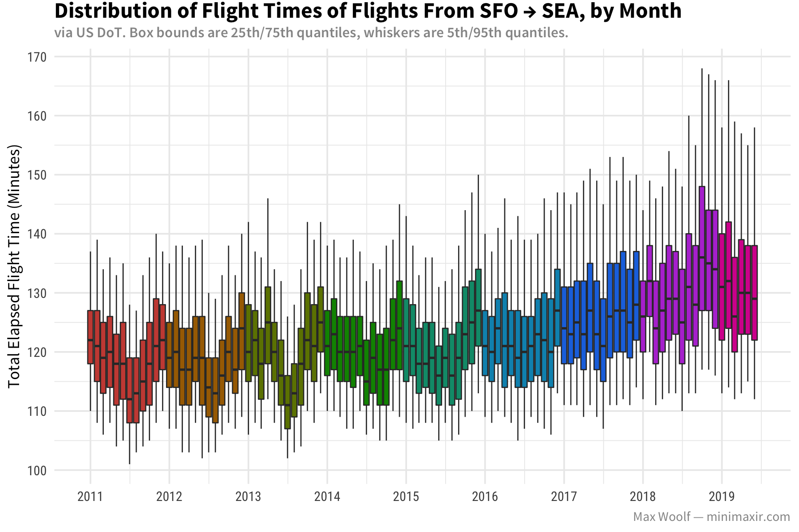
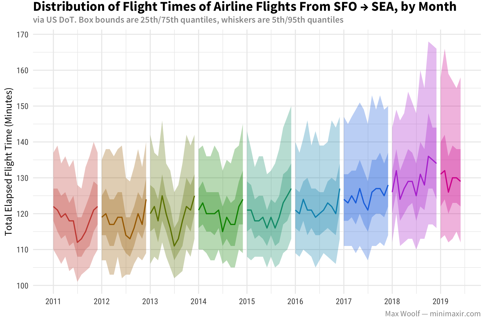
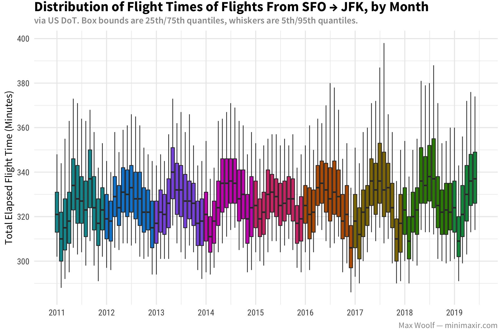
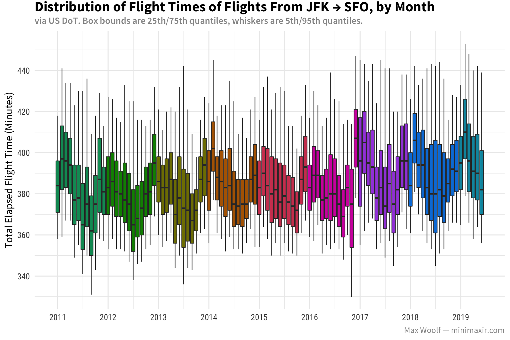
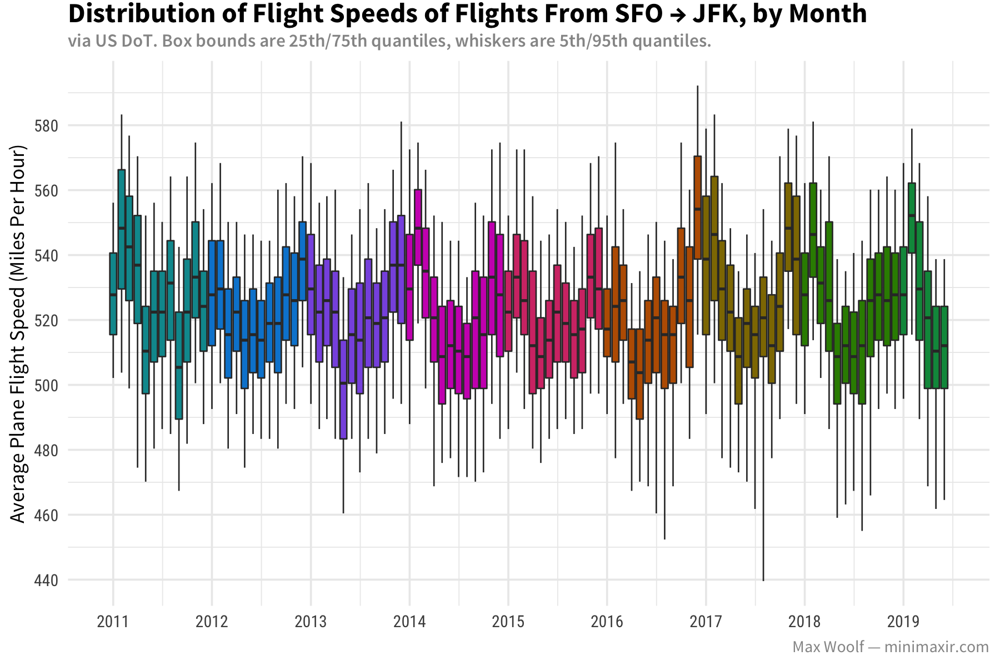
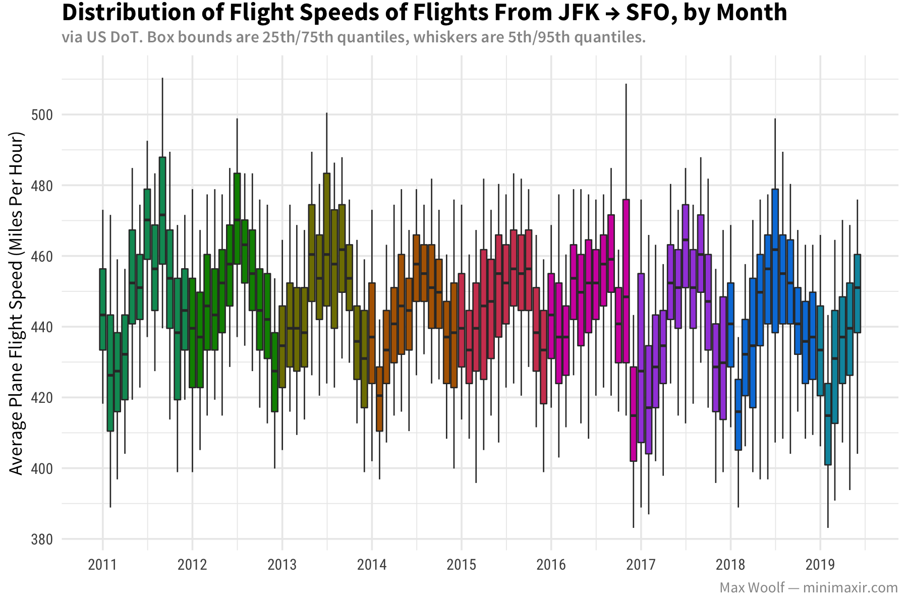
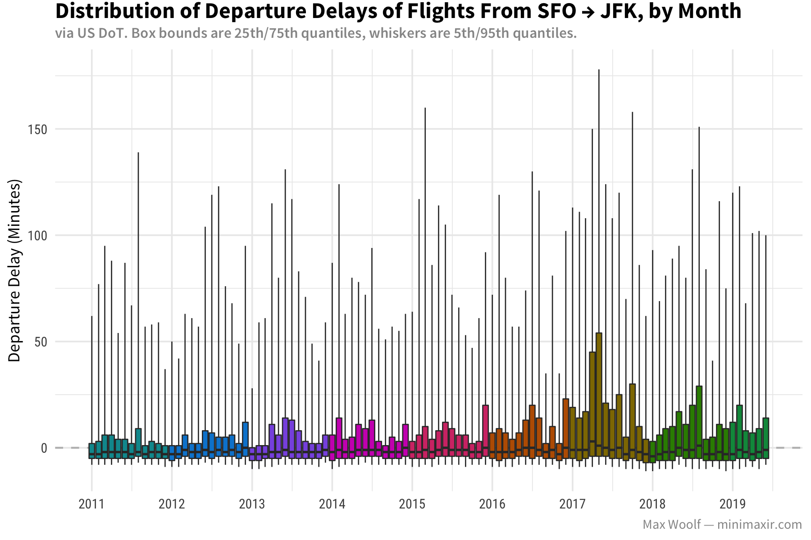
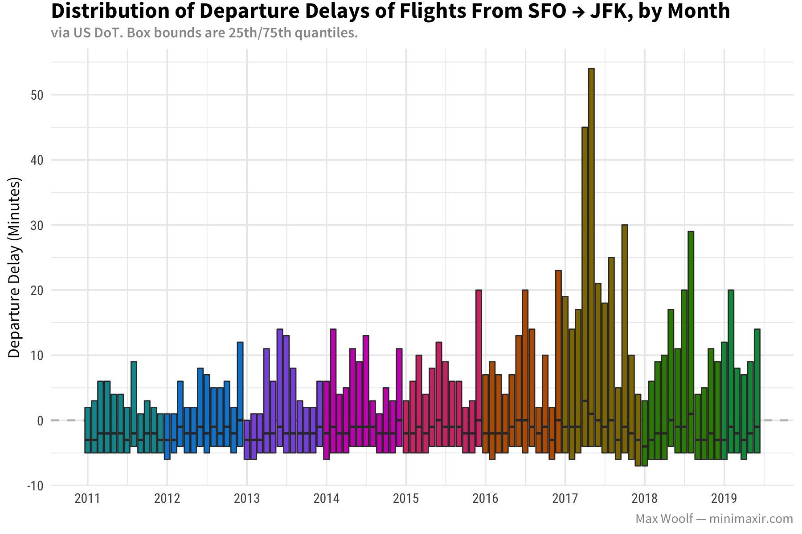
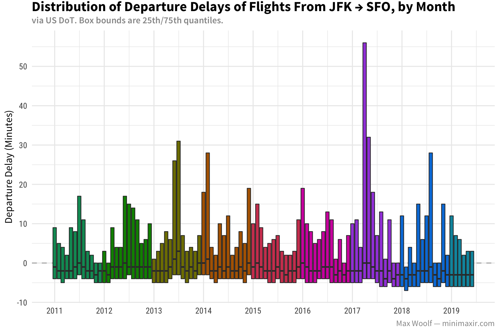

This notebook is licensed under the MIT License. If you use the code or data visualization designs contained within this notebook, it would be greatly appreciated if proper attribution is given back to this notebook and/or myself. Thanks! :)

Via https://twitter.com/felipehoffa/status/1111050585120206848

## Setup

```{r}
library(tidyverse)
library(scales)
library(lubridate)
library(bigrquery)

sessionInfo()
```

```{r}
# Switch to your own GCP project ID
project_id <- "<PROJECT_ID>"  
```


```{r}
theme_set(theme_minimal(base_size=9, base_family="Source Sans Pro") +
            theme(plot.title = element_text(family="Source Sans Pro Bold", margin=margin(t = -0.1, b = 0.1, unit='cm'), size=12),
                  axis.title.x = element_text(),
                  axis.title.y = element_text(),
                  axis.text.y = element_text(family="Roboto Condensed"),
                  axis.text.x = element_text(family="Roboto Condensed"),
                  plot.subtitle = element_text(family="Source Sans Pro Semibold", color="#969696", size=8),
                  plot.caption = element_text(color="#969696"),
                  legend.title = element_text(),
                  legend.key.width = unit(0.25, unit='cm')))
```

# EDA

## SFO → SEA Flight Duration

```{r}
query <- "
#standardSQL
SELECT Year, Month, num_flights,
time_q[OFFSET(5)] AS q_5,
time_q[OFFSET(25)] AS q_25,
time_q[OFFSET(50)] AS q_50,
time_q[OFFSET(75)] AS q_75,
time_q[OFFSET(95)] AS q_95
FROM (
SELECT Year, Month,
  COUNT(*) as num_flights,
  APPROX_QUANTILES(ActualElapsedTime, 100) AS time_q
FROM `fh-bigquery.flights.ontime_201908`
WHERE Origin = 'SFO'
AND Dest = 'SEA'
AND FlightDate_year > '2010-01-01'
GROUP BY Year, Month
)
ORDER BY Year, Month
"

df <- bq_project_query(project_id, query) %>% bq_table_download()

# ggplot2 likes a date for timeseries
df_tf <- df %>%
          mutate(date = ymd(paste(Year, Month, "1")),
                 year_factor = factor(as.numeric(Year)))

df_tf %>% head(10)
```

NB: As of ggplot 3.2.0, you must have the `group` aesthetic for boxplots manually specifying the bounds. (https://stackoverflow.com/q/57192727)

```{r}
plot <-
  ggplot(df_tf,
         aes(
           x = date,
           ymin = q_5,
           lower = q_25,
           middle = q_50,
           upper = q_75,
           ymax = q_95,
           group = date,
           fill = year_factor
         )) +
  geom_boxplot(stat = "identity") +
  scale_fill_hue(l=50, guide=F) +
  scale_x_date(date_breaks = '1 year', date_labels = "%Y") +
  scale_y_continuous(breaks = pretty_breaks(6)) +
  labs(
    title = "Distribution of Flight Times of Flights From SFO → SEA, by Month",
    subtitle = "via US DoT. Box bounds are 25th/75th quantiles, whiskers are 5th/95th quantiles.",
    y = 'Total Elapsed Flight Time (Minutes)',
    fill = '',
    caption = 'Max Woolf — minimaxir.com'
  ) +
  theme(axis.title.x = element_blank())

ggsave('sfo_sea_flight_duration.png',
       plot,
       width = 6,
       height = 4)
```



Alternate approach using ribbons (not used in final blog post since harder to visually parse, but present here for posterity):

```{r}
plot <-
  ggplot(df_tf,
         aes(
           x = date,
           #group = "all",
           color = year_factor,
           fill = year_factor
         )) +
  geom_ribbon(aes(ymin = q_5, ymax = q_95), alpha=0.3, size=0, stat = "identity") +
  geom_ribbon(aes(ymin = q_25, ymax = q_75), alpha=0.3, size=0, stat = "identity") +
  geom_line(aes(y = q_50), stat = "identity") +
  scale_color_hue(l=50, guide=F) +
  scale_fill_hue(l=50, guide=F) +
  scale_x_date(date_breaks = '1 year', date_labels = "%Y") +
  scale_y_continuous(breaks = pretty_breaks(6)) +
  labs(
    title = "Distribution of Flight Times of Airline Flights From SFO → SEA, by Month",
    subtitle = "via US DoT. Box bounds are 25th/75th quantiles, whiskers are 5th/95th quantiles",
    y = 'Total Elapsed Flight Time (Minutes)',
    fill = '',
    color = '',
    caption = 'Max Woolf — minimaxir.com'
  ) +
  theme(axis.title.x = element_blank())

ggsave('sfo_sea_flight_duration_ribbon.png',
       plot,
       width = 6,
       height = 4)
```



## SFO → JFK Distribution

```{r}
query <- "
#standardSQL
SELECT Year, Month, num_flights,
time_q[OFFSET(5)] AS q_5,
time_q[OFFSET(25)] AS q_25,
time_q[OFFSET(50)] AS q_50,
time_q[OFFSET(75)] AS q_75,
time_q[OFFSET(95)] AS q_95
FROM (
SELECT Year, Month,
  COUNT(*) as num_flights,
  APPROX_QUANTILES(ActualElapsedTime, 100) AS time_q
FROM `fh-bigquery.flights.ontime_201908`
WHERE Origin = 'SFO'
AND Dest = 'JFK'
AND FlightDate_year > '2010-01-01'
GROUP BY Year, Month
)
ORDER BY Year, Month
"

df <- bq_project_query(project_id, query) %>% bq_table_download()

df_tf <- df %>%
          mutate(date = ymd(paste(Year, Month, "1")),
                 year_factor = factor(as.numeric(Year)))

df_tf %>% head(10)
```

```{r}
plot <-
  ggplot(df_tf,
         aes(
           x = date,
           ymin = q_5,
           lower = q_25,
           middle = q_50,
           upper = q_75,
           ymax = q_95,
           group = date,
           fill = year_factor
         )) +
  geom_boxplot(stat = "identity") +
  scale_fill_brewer(palette="Spectral", guide=F) +
  scale_x_date(date_breaks = '1 year', date_labels = "%Y") +
  scale_y_continuous(breaks = pretty_breaks(6)) +
  labs(
    title = "Distribution of Flight Times of Flights From SFO → JFK, by Month",
    subtitle = "via US DoT. Box bounds are 25th/75th quantiles, whiskers are 5th/95th quantiles.",
    y = 'Total Elapsed Flight Time (Minutes)',
    fill = '',
    caption = 'Max Woolf — minimaxir.com'
  ) +
  theme(axis.title.x = element_blank())

ggsave('sfo_jfk_flight_duration.png',
       plot,
       width = 6,
       height = 4)
```



## JFK → SFO Flight Time Distribution

```{r}
query <- "
#standardSQL
SELECT Year, Month, num_flights,
time_q[OFFSET(5)] AS q_5,
time_q[OFFSET(25)] AS q_25,
time_q[OFFSET(50)] AS q_50,
time_q[OFFSET(75)] AS q_75,
time_q[OFFSET(95)] AS q_95
FROM (
SELECT Year, Month,
  COUNT(*) as num_flights,
  APPROX_QUANTILES(ActualElapsedTime, 100) AS time_q
FROM `fh-bigquery.flights.ontime_201908`
WHERE Origin = 'JFK'
AND Dest = 'SFO'
AND FlightDate_year > '2010-01-01'
GROUP BY Year, Month
)
ORDER BY Year, Month
"

df <- bq_project_query(project_id, query) %>% bq_table_download()

df_tf <- df %>%
          mutate(date = ymd(paste(Year, Month, "1")),
                 year_factor = factor(as.numeric(Year)))

df_tf %>% head(10)
```


```{r}
plot <-
  ggplot(df_tf,
         aes(
           x = date,
           ymin = q_5,
           lower = q_25,
           middle = q_50,
           upper = q_75,
           ymax = q_95,
           group = date,
           fill = year_factor
         )) +
  geom_boxplot(stat = "identity") +
  scale_fill_brewer(palette="RdYlBu", guide=F) +
  scale_x_date(date_breaks = '1 year', date_labels = "%Y") +
  scale_y_continuous(breaks = pretty_breaks(6)) +
  labs(
    title = "Distribution of Flight Times of Flights From JFK → SFO, by Month",
    subtitle = "via US DoT. Box bounds are 25th/75th quantiles, whiskers are 5th/95th quantiles.",
    y = 'Total Elapsed Flight Time (Minutes)',
    fill = '',
    caption = 'Max Woolf — minimaxir.com'
  ) +
  theme(axis.title.x = element_blank())

ggsave('jfk_sfo_flight_duration.png',
       plot,
       width = 6,
       height = 4)
```



## SFO → JFK Flight Speed

```{r}
query <- "#standardSQL
SELECT Year, Month, num_flights,
time_q[OFFSET(5)] AS q_5,
time_q[OFFSET(25)] AS q_25,
time_q[OFFSET(50)] AS q_50,
time_q[OFFSET(75)] AS q_75,
time_q[OFFSET(95)] AS q_95
FROM (
SELECT Year, Month,
  COUNT(*) as num_flights,
  APPROX_QUANTILES(Distance/(AirTime/60), 100) AS time_q
FROM `fh-bigquery.flights.ontime_201908`
WHERE Origin = 'SFO'
AND Dest = 'JFK'
AND FlightDate_year > '2010-01-01'
GROUP BY 1, 2
)
ORDER BY Year, Month"

df <- bq_project_query(project_id, query) %>% bq_table_download()

df_tf <- df %>%
          mutate(date = ymd(paste(Year, Month, "1")),
                 year_factor = factor(as.numeric(Year)))

df_tf %>% head(10)
```

```{r}
plot <-
  ggplot(df_tf,
         aes(
           x = date,
           ymin = q_5,
           lower = q_25,
           middle = q_50,
           upper = q_75,
           ymax = q_95,
           group = date,
           fill = year_factor
         )) +
  geom_boxplot(stat = "identity") +
  scale_fill_brewer(palette="Spectral", guide=F) +
  scale_x_date(date_breaks = '1 year', date_labels = "%Y") +
  scale_y_continuous(breaks = pretty_breaks(6)) +
  labs(
    title = "Distribution of Flight Speeds of Flights From SFO → JFK, by Month",
    subtitle = "via US DoT. Box bounds are 25th/75th quantiles, whiskers are 5th/95th quantiles.",
    y = 'Average Plane Flight Speed (Miles Per Hour)',
    fill = '',
    caption = 'Max Woolf — minimaxir.com'
  ) +
  theme(axis.title.x = element_blank())

ggsave('sfo_jfk_flight_speed.png',
       plot,
       width = 6,
       height = 4)
```



## JFK → SFO Flight Speed

```{r}
query <- "#standardSQL
SELECT Year, Month, num_flights,
time_q[OFFSET(5)] AS q_5,
time_q[OFFSET(25)] AS q_25,
time_q[OFFSET(50)] AS q_50,
time_q[OFFSET(75)] AS q_75,
time_q[OFFSET(95)] AS q_95
FROM (
SELECT Year, Month,
  COUNT(*) as num_flights,
  APPROX_QUANTILES(Distance/(AirTime/60), 100) AS time_q
FROM `fh-bigquery.flights.ontime_201908`
WHERE Origin = 'JFK'
AND Dest = 'SFO'
AND FlightDate_year > '2010-01-01'
GROUP BY 1, 2
)
ORDER BY Year, Month"

df <- bq_project_query(project_id, query) %>% bq_table_download()

df_tf <- df %>%
          mutate(date = ymd(paste(Year, Month, "1")),
                 year_factor = factor(as.numeric(Year)))

df_tf %>% head(10)
```

```{r}
plot <-
  ggplot(df_tf,
         aes(
           x = date,
           ymin = q_5,
           lower = q_25,
           middle = q_50,
           upper = q_75,
           ymax = q_95,
           group = date,
           fill = year_factor
         )) +
  geom_boxplot(stat = "identity") +
  scale_fill_brewer(palette="RdYlBu", guide=F) +
  scale_x_date(date_breaks = '1 year', date_labels = "%Y") +
  scale_y_continuous(breaks = pretty_breaks(6)) +
  labs(
    title = "Distribution of Flight Speeds of Flights From JFK → SFO, by Month",
    subtitle = "via US DoT. Box bounds are 25th/75th quantiles, whiskers are 5th/95th quantiles.",
    y = 'Average Plane Flight Speed (Miles Per Hour)',
    fill = '',
    caption = 'Max Woolf — minimaxir.com'
  ) +
  theme(axis.title.x = element_blank())

ggsave('jfk_sfo_flight_speed.png',
       plot,
       width = 6,
       height = 4)
```



## SFO → JFK Departure Delay

```{r}
query <- "#standardSQL
SELECT Year, Month, num_flights,
time_q[OFFSET(5)] AS q_5,
time_q[OFFSET(25)] AS q_25,
time_q[OFFSET(50)] AS q_50,
time_q[OFFSET(75)] AS q_75,
time_q[OFFSET(95)] AS q_95
FROM (
SELECT Year, Month,
  COUNT(*) as num_flights,
  APPROX_QUANTILES(DepDelay, 100) AS time_q
FROM `fh-bigquery.flights.ontime_201908`
WHERE Origin = 'SFO'
AND Dest = 'JFK'
AND FlightDate_year > '2010-01-01'
GROUP BY 1, 2
)
ORDER BY Year, Month"

df <- bq_project_query(project_id, query) %>% bq_table_download()

df_tf <- df %>%
          mutate(date = ymd(paste(Year, Month, "1")),
                 year_factor = factor(as.numeric(Year)))

df_tf %>% head(10)
```

```{r}
plot <-
  ggplot(df_tf,
         aes(
           x = date,
           ymin = q_5,
           lower = q_25,
           middle = q_50,
           upper = q_75,
           ymax = q_95,
           group = date,
           fill = year_factor
         )) +
  geom_hline(yintercept=0, linetype='dashed', color="gray") +
  geom_boxplot(stat = "identity") +
  scale_fill_brewer(palette="Spectral", guide=F) +
  scale_x_date(date_breaks = '1 year', date_labels = "%Y") +
  scale_y_continuous(breaks = pretty_breaks(6)) +
  labs(
    title = "Distribution of Departure Delays of Flights From SFO → JFK, by Month",
    subtitle = "via US DoT. Box bounds are 25th/75th quantiles, whiskers are 5th/95th quantiles.",
    y = 'Departure Delay (Minutes)',
    fill = '',
    caption = 'Max Woolf — minimaxir.com'
  ) +
  theme(axis.title.x = element_blank())

ggsave('sfo_jfk_departure_delay.png',
       plot,
       width = 6,
       height = 4)
```



Remove whiskers since it distorts the graph unhelpfully.

```{r}
plot <-
  ggplot(df_tf,
         aes(
           x = date,
           ymin = q_25,
           lower = q_25,
           middle = q_50,
           upper = q_75,
           ymax = q_75,
           group = date,
           fill = year_factor
         )) +
  geom_hline(yintercept=0, linetype='dashed', color="gray") +
  geom_boxplot(stat = "identity") +
  scale_fill_brewer(palette="Spectral", guide=F) +
  scale_x_date(date_breaks = '1 year', date_labels = "%Y") +
  scale_y_continuous(breaks = pretty_breaks(6)) +
  labs(
    title = "Distribution of Departure Delays of Flights From SFO → JFK, by Month",
    subtitle = "via US DoT. Box bounds are 25th/75th quantiles.",
    y = 'Departure Delay (Minutes)',
    fill = '',
    caption = 'Max Woolf — minimaxir.com'
  ) +
  theme(axis.title.x = element_blank())

ggsave('sfo_jfk_departure_delay_nowhiskers.png',
       plot,
       width = 6,
       height = 4)
```



## JFK → SFO Departure Delay

```{r}
query <- "#standardSQL
SELECT Year, Month, num_flights,
time_q[OFFSET(5)] AS q_5,
time_q[OFFSET(25)] AS q_25,
time_q[OFFSET(50)] AS q_50,
time_q[OFFSET(75)] AS q_75,
time_q[OFFSET(95)] AS q_95
FROM (
SELECT Year, Month,
  COUNT(*) as num_flights,
  APPROX_QUANTILES(DepDelay, 100) AS time_q
FROM `fh-bigquery.flights.ontime_201908`
WHERE Origin = 'JFK'
AND Dest = 'SFO'
AND FlightDate_year > '2010-01-01'
GROUP BY 1, 2
)
ORDER BY Year, Month"

df <- bq_project_query(project_id, query) %>% bq_table_download()

df_tf <- df %>%
          mutate(date = ymd(paste(Year, Month, "1")),
                 year_factor = factor(as.numeric(Year)))

df_tf %>% head(10)
```

```{r}
plot <-
  ggplot(df_tf,
         aes(
           x = date,
           ymin = q_25,
           lower = q_25,
           middle = q_50,
           upper = q_75,
           ymax = q_75,
           group = date,
           fill = year_factor
         )) +
  geom_hline(yintercept=0, linetype='dashed', color="gray") +
  geom_boxplot(stat = "identity") +
  scale_fill_brewer(palette="RdYlBu", guide=F) +
  scale_x_date(date_breaks = '1 year', date_labels = "%Y") +
  scale_y_continuous(breaks = pretty_breaks(6)) +
  labs(
    title = "Distribution of Departure Delays of Flights From JFK → SFO, by Month",
    subtitle = "via US DoT. Box bounds are 25th/75th quantiles.",
    y = 'Departure Delay (Minutes)',
    fill = '',
    caption = 'Max Woolf — minimaxir.com'
  ) +
  theme(axis.title.x = element_blank())

ggsave('jfk_sfo_departure_delay_nowhiskers.png',
       plot,
       width = 6,
       height = 4)
```



# LICENSE

MIT License

Copyright (c) 2019 Max Woolf

Permission is hereby granted, free of charge, to any person obtaining a copy
of this software and associated documentation files (the "Software"), to deal
in the Software without restriction, including without limitation the rights
to use, copy, modify, merge, publish, distribute, sublicense, and/or sell
copies of the Software, and to permit persons to whom the Software is
furnished to do so, subject to the following conditions:

The above copyright notice and this permission notice shall be included in all
copies or substantial portions of the Software.

THE SOFTWARE IS PROVIDED "AS IS", WITHOUT WARRANTY OF ANY KIND, EXPRESS OR
IMPLIED, INCLUDING BUT NOT LIMITED TO THE WARRANTIES OF MERCHANTABILITY,
FITNESS FOR A PARTICULAR PURPOSE AND NONINFRINGEMENT. IN NO EVENT SHALL THE
AUTHORS OR COPYRIGHT HOLDERS BE LIABLE FOR ANY CLAIM, DAMAGES OR OTHER
LIABILITY, WHETHER IN AN ACTION OF CONTRACT, TORT OR OTHERWISE, ARISING FROM,
OUT OF OR IN CONNECTION WITH THE SOFTWARE OR THE USE OR OTHER DEALINGS IN THE
SOFTWARE.